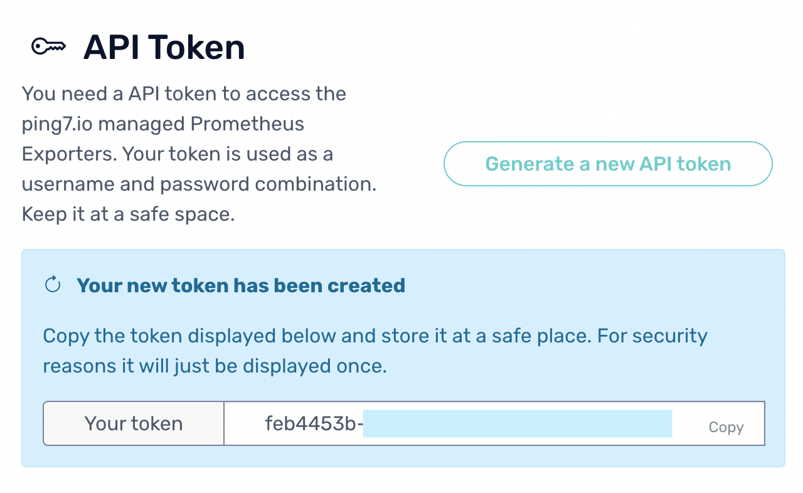

# 🪡 Grafana - Integration


Before we start, sign up for a [free account grafana.com](https://grafana.com/auth/sign-up/create-user?pg=hp&plcmt=hero-btn1&cta=create-free-account)

### 🔬 Prepare lab environment

This writes some instance metadata into a Docker Compose environment
file. We'll use those values when launching Docker containers for tagging
logs and traces.

```
cd ~/o11y-workshop/prometheus-grafana
../instance-metadata.sh > .env
```

## 📖 Metrics (via a local Prometheus)

> 💡 This deplyoment pattern is common to overcome the rather limited
> free metrics volume in Grafana Cloud


### Launch a local Prometheus

Apply the instance metadata we created above to prepare the
Prometheus configuration. We are templating using `envsubst`:

```
set -a; source .env; set +a
envsubst < rootfs/etc/prometheus/prometheus.yaml.template > rootfs/etc/prometheus/prometheus.yaml
```

Now launch Prometheus

```
docker-compose -f docker-compose-metrics.yaml up -d
```

Verify that [your Prometheus is running](https://prometheus.PETNAME.workshop.o11ystack.org/). Check what targets and services
he discovered out of the box.

### Configure Grafana Cloud


[Log into your Grafana cloud account](https://grafana.com/auth/sign-in)
and launch Grafana.

#### Configure Prometheus Data Source


Go to `Configuration -> Data Sources` and add a new Prometheus Data Source.
Make it default and use the url `https://prometheus.PETNAME.workshop.o11ystack.org`.

> You can verify that your metrics are available in Grafana using the `Explore` section.

#### Import Dashboards into Grafana Cloud


In Grafana, import the following Dashboards using their Grafana Cloud ID

* `1860` - [Node Exporter](https://grafana.com/grafana/dashboards/1860-node-exporter-full/)
* `4701`- [JVM Micrometer](https://grafana.com/grafana/dashboards/4701-jvm-micrometer/)
* `9628` - [Postgresql](https://grafana.com/grafana/dashboards/9628-postgresql-database/)
* `11462` - [Traefik 2](https://grafana.com/grafana/dashboards/11462-traefik-2/)


## 🪵 Log Management


[Log into your Grafana cloud account](https://grafana.com/auth/sign-in)
and select `Loki -> Details`. Here you'll find the credentials you need
to ingest log data to Grafana Loki.

Append these personal secrets to the environment file:

```
echo "GRAFANA_LOKI_USERNAME=32.. >> .env"
echo "GRAFANA_API_KEY=eyJrIjoi.. >> .env"
```

We use Promtail as log ingester which we launch in a Docker container

```
docker-compose -f docker-compose-logs.yaml up
```

> You can verify that your logs are available in Grafana using the `Explore` section.

## 🥷 Tracing

[Log into your Grafana cloud account](https://grafana.com/auth/sign-in)
and select `Tempo -> Details`. Here you'll find the credentials you need
to ingest log data to Grafana Tempo.

Append these personal secrets to the environment file:

```
echo "GRAFANA_TEMPO_USERNAME=3.. >> .env"
```

We'll launch a a Grafana Agent as tracing proxy that authenticates against Grafana
Cloud.

```
docker-compose -f docker-compose-tracing.yaml up
```

> This proxy pattern is pretty common (pretty much like a federated Prometheus)

#### 🐾 Instrument the Petclinic

Grafana uses the bare Open Telemetry Java Agent to instrument an application.
We can download a recent release from GitHub.

```bash
cd ~/o11y-workshop/spring-petclinic
sudo curl -sLfo /usr/local/share/opentelemetry-javaagent.jar \
    "https://github.com/open-telemetry/opentelemetry-java-instrumentation/releases/download/v1.19.2/opentelemetry-javaagent.jar"
```

Now we have to add several environment variables to the Petclinic's Docker Compose
file. We also need to mount the downloaded OpenTelemetry agent into the Docker
container.

```yaml
environment:
    - OTEL_EXPORTER=otlp_span
    - OTEL_EXPORTER_OTLP_ENDPOINT=http://grafana_agent:4317
    - OTEL_EXPORTER_OTLP_INSECURE=true
    - OTEL_RESOURCE_ATTRIBUTES=service.name=petclinic
    - JAVA_TOOL_OPTIONS="-javaagent:/usr/local/share/opentelemetry-javaagent.jar"
volumes:
  - /usr/local/share/opentelemetry-javaagent.jar:/usr/local/share/opentelemetry-javaagent.jar
```

> The Grafana Agent can be reached via a Docker network as `grafana_agent`.

## 🌍 Uptime monitoring

Create a [free account at ping7.io](https://ping7.io/login) and save
your API token.



Add your API token to your environment secrets.

```
cd ~/o11y-workshop/prometheus-grafana
echo "PING7IO_TOKEN=feb4453b-... >> .env"
```

Now append a new scrape job to your existing Prometheus configuration.
Restart Prometheus afterwards.

```bash
set -a; source .env; set +a
envsubst < rootfs/etc/prometheus/prometheus.ping7io.yaml.template \
    >> rootfs/etc/prometheus/prometheus.yaml
```

Check that your uptime metrics are available in Grafana. You
can add a [Blackbox-Exporter Dashboard to Grafana](https://github.com/ping7io/examples/blob/main/dashboards/blackbox-exporter-ping7.io.json)
in order to visualize those.


## 🚮 Uninstall

Shut down all Docker containers we just launched.

```bash
docker-compose -f docker-compose-metrics.yaml down
docker-compose -f docker-compose-logs.yaml down
docker-compose -f docker-compose-tracing.yaml down
```
